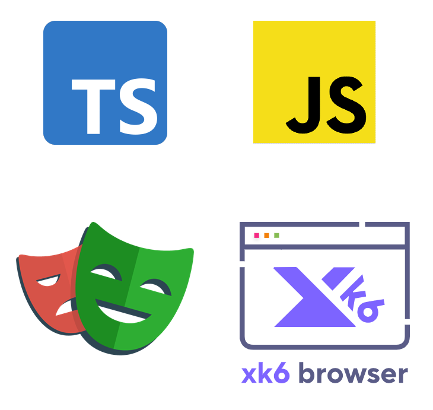

<p align="center">
  <a href="https://k6.io/docs/javascript-api/xk6-browser/">
  
  </a>
</p>
<h1 align="center">
End-to-end and Load Testing Monorepo
<br>
 Playwright + xk6-browser + Typescript
</h1>

This repository template is an extention to the <a href="https://github.com/grafana/k6-template-typescript"> Typescript template </a> and creates a <a href="https://www.typescriptlang.org/"> Typescript </a> monorepo that includes:

- End-to-end testing using <a href="https://playwright.dev/"> Playwright </a>
- Load, smoke, stress and soak testing using <a href="https://k6.io/docs/"> k6 </a> and <a href="https://k6.io/docs/javascript-api/xk6-browser/"> xk6-browser </a>

Because xk6-browser roughly adheres to Playwright's browser API, this enables you to share page actions and logic between the two, drastically reducing duplication. By using Typescript you have better autocomplete DX, tests are better maintainable and you can use modern Javascript futures such as async/await, which is not supported by k6 by default (ES5.1).

## Structure

- src/k6 - **k6 and xk6-browser tests**
  - Typescript files that get transpiled to ES5.1 javascript files (using webpack and babel), so that they can be ran by xk6-browser
- src/playwright - **playwright tests**
  - Typescript files that can be directly ran by Playwright
- src/pages - **page actions**
  - Typescript files that can be used by both the k6 and playwright tests by using the import path `@pages/<shared files>`

## Example

`src/k6/sample-test.ts`

```Typescript
import { browser } from 'k6/experimental/browser';
import { check } from 'k6';
import { clickSlots } from '../pages/example-page';

export const options = {
    vus: 10,
    maxRedirects: 20,
    scenarios: {
        ui: {
            executor: 'shared-iterations',
            vus: 10,
            iterations: 200,
            options: {
                browser: {
                    type: 'chromium',
                    headless: 'true',
                },
            },
        },
    },
    thresholds: {
        checks: ["rate==1.0"]
    }
}

export default async function () {
    const context = browser.newContext();
    let page = context.newPage();

    try {
        await Promise.all([
            await clickSlots(page)
        ])
        check(page, {
            'slots should open': (p) =>
                p.locator('#cartur').textContent() === 'Cart',
        });
    } finally {
        page.close();
    }
}
```

`src/playwright/example.spec.ts`

```Typescript
import { test, expect } from '@playwright/test';
import { clickSlots } from '../pages/example-page';

test('slots should open', async ({ page }) => {
  await clickSlots(page);

  const mainTitle = page.locator('#cartur');

  await expect(mainTitle).toHaveText('Cart');
});
```

`src/pages/example-page.ts`

```Typescript
import type { Page } from "@playwright/test/types/test";

export async function clickSlots(page: Page) {
    await page.goto('https://www.demoblaze.com/', { waitUntil: 'networkidle' })
}
```

## Installation

### Create a repository using this template

git clone -https://github.com/Lipsa16QE/k6playwright.git

### Install dependencies

Clone the generated repository on your local machine, move to the project root folder and install the dependencies defined in [`package.json`](./package.json)

```bash
$ npm i
```

## Running k6 tests

To run a k6 test:

```bash
$ npm run k6 dist/k6/example-test.js
```

This command does the following things:

- Transpiles the Typescript files from `./src` to Javascript test files in the `./dist` folder using `Babel` and `Webpack` (you can also do this separately using `npm run build`). [Learn more](https://k6.io/docs/using-k6/modules#bundling-node-modules)
- Runs the provided transpiled test with k6 using the Dockerfile and docker-compose, which will mount the `./dist` folder to `/dist`, making the tests in there available for the container.

### Assumptions

- The tests need to have the "_test_" word in the name to distinguish them from auxiliary files. You can change the entry [here](./webpack.config.js#L8).
- If static files are required then add them to `./assets` folder. Its content gets copied to the destination folder (`dist`) along with compiled scripts.

## Running Playwright tests

Run all playwright tests simply using:

```bash
$ npm run playwright
```

[Learn more](https://playwright.dev/docs/intro) about Playwright and running tests.
